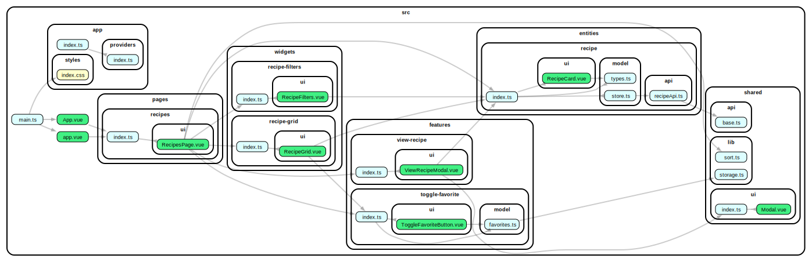

# Project Architecture

## High level project structure

```
src/
├── app/        # App-level init, layout, providers, routing, etc
├── entities/   # Domain entities, core business logic
├── features/   # Reusable utils, UI components, types, etc.
├── pages/      # Page-level views
├── shared/     # Reusable utils, UI components, types, etc.
└── widgets/    # Composite UI blocks (cross-feature)
```

This architecture forces a uni-directional dependency flow:
```shared → entities → features → widgets → pages → app```
This prevents unintended coupling between components and circular dependencies.

## Project dependency graph


